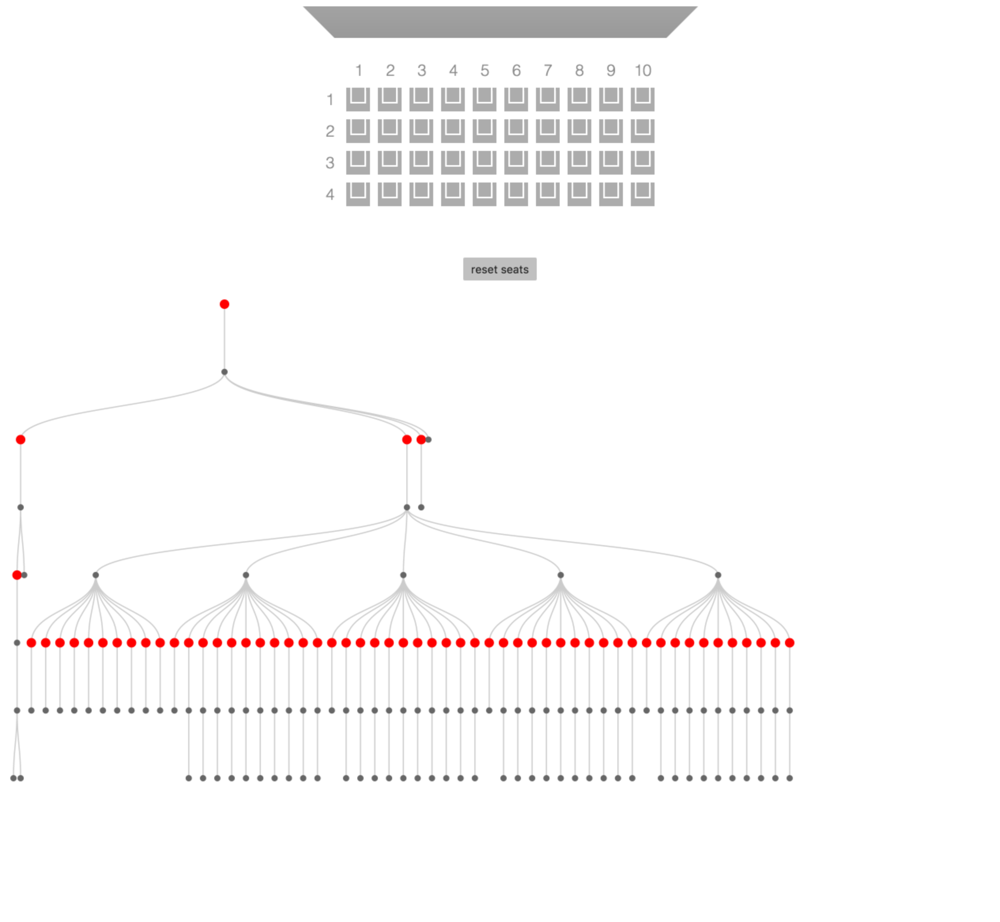

# react-dom-visualizer

*Visualize components structure in your React application as a tree chart*



## Installation
```
npm i -D react-dom-visualizer
```

This tool in using `__REACT_DEVTOOLS_GLOBAL_HOOK__` which is also used by React Developer Tools. They are not working together. Make sure to disable React DevTools extension before running your app with `react-dom-visualizer`.

## Usage
Run example app `cd example && npm run example:start`, open [localhost:3000](http://localhost:3000) in your browser.
```jsx
import visualize from 'react-dom-visualizer'; // should be included before React
import React from 'react';
import { render } from 'react-dom';
import App from './components/app';

render(<App />, document.getElementById('app'));

// should be called after render
visualize({
  selector: '#viz',
  width: 1000,
  height: 800,
  displayLabels: false,
  treeConfig: {
    width: 1000,
    height: 600
  }
});
```

MIT
